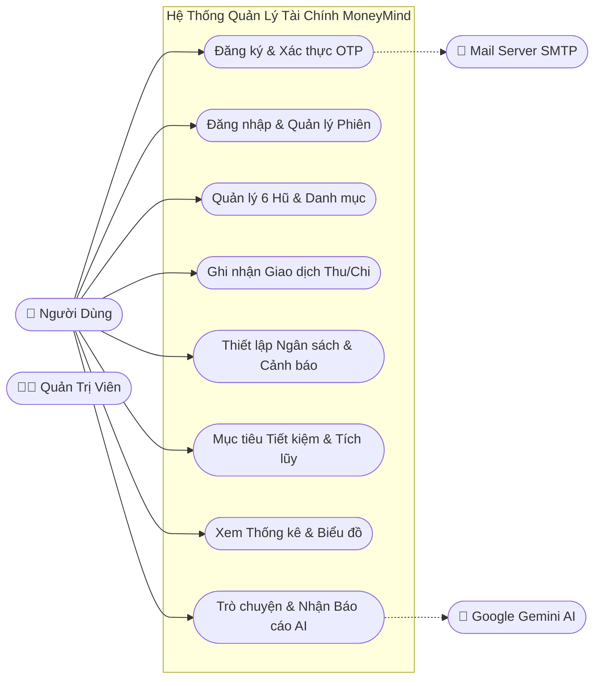
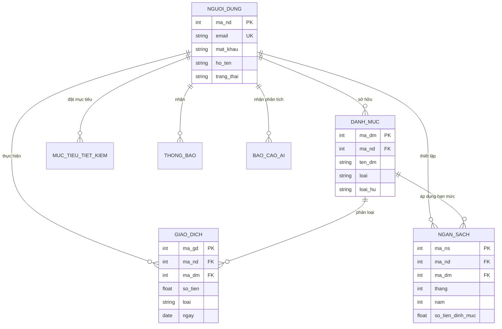
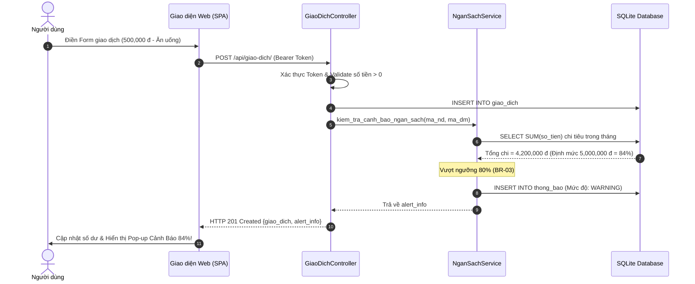

# Kỹ Năng: Thiết Kế & Sinh Sơ Đồ Chuẩn UML (UML Architecture)

Kỹ năng cung cấp bộ tài liệu trực quan hóa toàn diện kiến trúc hệ thống MoneyMind bằng sơ đồ chuẩn UML quốc tế (sử dụng Mermaid.js).

---

## 1. Sơ Đồ Use Case Tổng Thể (System Use Case)

---

## 2. Sơ Đồ Thực Thể - CSDL (Entity Relationship Diagram - ERD)

---

## 3. Sơ Đồ Trình Tự (Sequence Diagram): Thêm Giao Dịch & Cảnh Báo

